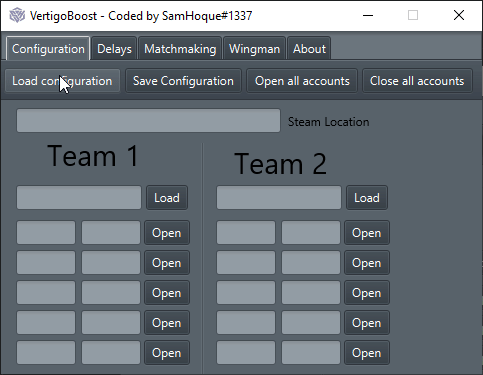

# Vertigo-Boosting-Panel
A tool that would allow you to use multiple instances of CSGO, all with different accounts. The main purpose of which is to vertigoboost such accounts.

# Screenshot

# License
This Vertigo Boosting Panel is licensed under the MIT license. See the file LICENSE for more information. If you plan to use any part of this source code in your own project, I would be grateful if you would include some form of credit somewhere.
